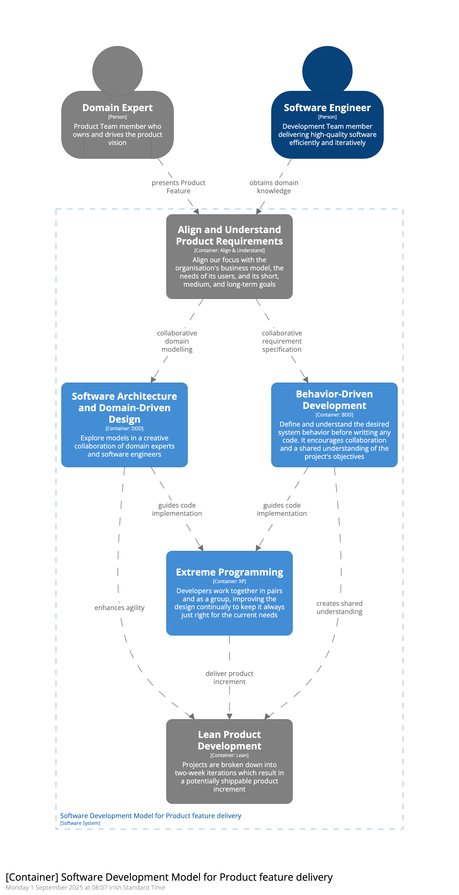

# Software Development Model for efficient Product Feature Delivery

This repository serves as a blueprint for an Agile Software Development Model, focused on efficient and scalable product
feature delivery. The model is built around five key focus areas — Align and Understand, BDD, DDD, XP, and Lean
Product Development — that together enable rapid, iterative, and high-quality software development.
See [CONTEXT.md](CONTEXT.md) for the vocabulary this repository uses.



The [C4 model](https://c4model.com/) is used in this repository to visualize the architecture of the Agile Software Development Model at
different levels of abstraction:

- **System Context Diagram**: Provides a high-level overview of the model, highlighting the main stakeholders and their
  interactions between them.
- **Container Diagram**: The Container Diagram dives deeper, illustrating the five focus areas that compose the model
  and how they communicate with each other. Each focus area is modelled as one C4 container.
- **Component Diagram**: Further decomposes each focus area into individual components, each representing a specific
  task or process within it, and illustrates how these components are structured and interact internally.

This repository also advocates for adopting a "diagrams and documentation as code" approach to software architecture and
design. This practice involves managing and versioning system diagrams and documentation in the same way as code. By
applying software development principles, this approach streamlines the creation, maintenance, and collaboration
processes, ensuring that architecture documentation remains agile, consistent, and aligned with modern development
practices.

By adopting this approach, teams can better integrate architecture documentation into their development workflows,
resulting in improved collaboration and a more cohesive understanding of the system architecture throughout the
development lifecycle.

## Tools and Technologies
This repository leverages the following tools and technologies:
 - Docker: Used to run the local Structurizr viewer in a containerized environment.
 - [Structurizr](https://docs.structurizr.com/local): The consolidated Structurizr tooling. Its `local` command serves the model for authoring and review, using the [Structurizr DSL](https://docs.structurizr.com/dsl).
 - [Structurizr Site Generatr](https://github.com/avisi-cloud/structurizr-site-generatr): A tool for generating a HTML microsite with diagrams, documentation, and a UI to explore the model.
 - Github Actions: Used to validate the model and generate the HTML microsite on every pull request, and to deploy it to Github Pages from `main`.


## Folder structure

```
├── compose.yaml           # Docker Compose file that starts the local Structurizr viewer
├── workspace.dsl          # Primary Structurizr DSL script defining the system architecture
├── site/                  # Structurizr documentation (Markdown/AsciiDoc rendered by the local viewer)
├── CONTEXT.md             # Glossary of this repository (focus area, container, ...)
├── docs/                  # Agent-authored documentation (see docs/agents/)
├── adrs/                  # Directory to store Markdown/AsciiDoc Architecture Decision Records (ADRs)
├── plantuml/              # PlantUML includes used only by the generated site (see c4-overrides.puml)
├── README.md              # Project documentation
├── .gitignore             # Git ignore file
└── ...
```
## Getting started
Install Docker:
- See [Get Docker](https://docs.docker.com/get-docker/) for installation instructions.

Start the local Structurizr viewer:

```shell
docker compose up
```

This serves the model at http://localhost:8080. Diagrams refresh on their own while you edit
`workspace.dsl`, so there is no need to reload the page. Stop the viewer with `docker compose down`.

The image version and the auto-refresh interval live in `compose.yaml`. Dependabot proposes a
new image version, and new versions of the workflow Actions, as a monthly pull request. See
[Structurizr - local](https://docs.structurizr.com/local) for the full set of options.

To generate the HTML microsite into `build/site`, run Structurizr Site Generatr from the same image
CI uses, so the local site matches the published one:

```shell
docker run --rm -v "$PWD":/var/model -w /var/model \
  ghcr.io/avisi-cloud/structurizr-site-generatr:1.6.0 generate-site -w workspace.dsl
```
Start a development web server around the generated website, at http://localhost:8081:

```shell
docker run --rm -p 8081:8080 -v "$PWD":/var/model -w /var/model \
  ghcr.io/avisi-cloud/structurizr-site-generatr:1.6.0 serve -w workspace.dsl -p 8080
```

The site generator's version is pinned in `.github/workflows/validate-and-publish-site.yaml`.
Dependabot does not watch it, so it is bumped by hand; keep the tag here in step with it.
## Contributing
We welcome contributions from the community. If you have suggestions or improvements, please open an issue or submit a
pull request. Ensure that your changes align with the overall vision and structure of the repository.

Every pull request is checked by both Structurizr DSL parsers in use: the consolidated tooling validates the workspace,
then Structurizr Site Generatr builds the site. The check fails if either parser rejects the workspace, if the site is
missing a documentation chapter or an ADR page, or if the build warns about the end of life of the Structurizr cloud
service. You can run the validation locally with:

```shell
docker compose run --rm structurizr validate -w workspace.dsl
```
